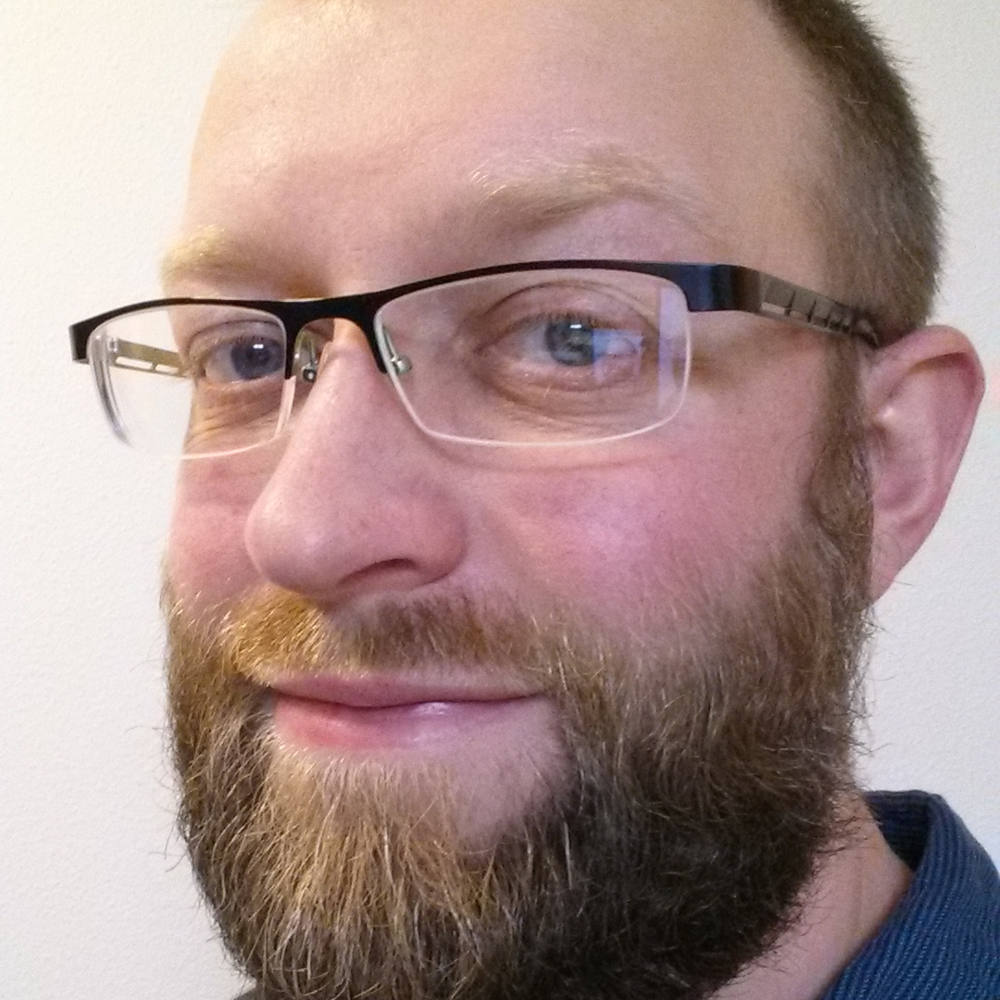

Aubrey Barnard
==============

2778 West Wedge 
Wisconsin Institutes for Medical Research 
1111 Highland Avenue 
Madison, WI 53705 
 
<code><a href="mailto:user-barnard@domain-cs.wisc.edu">user-barnard@domain-cs.wisc.edu</a></code>  
<ul class="social-media-list">
<li><a href="https://github.com/{{ site.github_username | cgi_escape | escape }}"><svg class="svg-icon"><use xlink:href="{{ '/assets/minima-social-icons.svg#github' | relative_url }}"/></svg> {{ site.github_username | escape }}</a></li>
<li><a href="https://www.linkedin.com/in/{{ site.linkedin_username | cgi_escape | escape }}"><svg class="svg-icon"><use xlink:href="{{ '/assets/minima-social-icons.svg#linkedin' | relative_url }}"/></svg> {{ site.linkedin_username | escape }}</a></li>
</ul>
<a href="barnard_cv.pdf">Curriculum Vitæ</a> |
<a href="barnard_resume.pdf">Résumé</a>

-----

I am a computer scientist doing machine learning research, mainly
related to medical applications of causal discovery in electronic health
records databases.  My research interests include algorithms, causality,
probabilistic graphical models, graphs, event history analysis / time
series, multi-relational rule learning, and databases.

In 2019, I earned my PhD in [Computer Sciences](
https://www.cs.wisc.edu/) from the [University of Wisconsin](
https://www.wisc.edu/), advised by [David Page](
http://pages.cs.wisc.edu/~dpage/) (who has moved to [Duke](
https://scholars.duke.edu/person/david.page)).  My [dissertation](
http://pages.cs.wisc.edu/~barnard/barnard_dissertation.pdf) was on
discovering the adverse effects of medications, through learning the
structure of Bayesian network causal models, and through analyzing
observational studies with machine learning for hypothesizing drug
effects.  This research produced a new method for Bayesian network
structure learning, and a novel causal discovery machine learning
approach based on analyzing before–after studies with temporal inverse
probability weighting.

While I mostly work with [Python]( https://www.python.org/) (e.g.,
[scikit-learn]( https://scikit-learn.org/), [NumPy]( https://numpy.org/)
/ [SciPy]( https://www.scipy.org/), [matplotlib](
https://matplotlib.org/), [PyTorch]( https://pytorch.org/)), I have been
writing all my numerical code in [Julia]( https://julialang.org/).  It
is as easy to use as Python—it is interactive, high-level, expressive,
multi-paradigm, dynamically-typed—but it runs at [machine speed](
https://julialang.org/benchmarks/) and has linear algebra and
concurrency built in.  I encourage you to [check](
https://learnxinyminutes.com/docs/julia/) [Julia](
https://docs.julialang.org/) [out]( https://julialang.org/learning/)!

I ran the UW–Madison [ML and AI Reading Group](
https://wiscairg.github.io/) for 5 semesters.

-----

Research Interests
------------------

* Algorithms
* Causality (in observational data)
* Probabilistic graphical models (including structural causal models),
  structure learning, inference
* Graph theory & algorithms
* Event sequences / time series (patient histories in electronic health
  records can be modeled as irregular, sparse, and noisy sequences of
  events)
* Multi-relational rule learning (inductive logic programming)
* Databases

Other Interests
---------------

* Open source software
* Software design and development
* Programming languages
* Linux
* Go (the [game]( https://en.wikipedia.org/wiki/Go_(game)), but the
  [language]( https://golang.org/) is cool, too)

Current Projects
----------------

* Identifying ovarian cancer earlier by inspecting electronic health
  records
* Pairwise interactions are sufficient for independence testing;
  generalized Hammersley–Clifford theorem
* Bayesian network structure learning via convex optimization
* Efficiently enumerating relevant cycles
* Scalable matching
* Speeding up cross validation with experimental design
* Principled, statistical comparison of graphs for evaluating structure
  learning
* Any-time inference for log-linear Markov networks via decreasing
  likelihood enumeration
* Better optimization for fitting log-linear models
* Faster and more optimal inductive logic programming via frequent
  itemset mining
* Replacing noisy-OR

Selected Papers
---------------

* Pairwise Interactions are Sufficient for Independence Testing\
  **Aubrey Barnard**, Scott Alfeld\
  In preparation

* Temporal Inverse Probability Weighting for Causal Discovery in
    Controlled Before–After Studies: Discovering ADEs in Generics\
  **Aubrey Barnard**, Peggy Peissig, David Page\
  Causal Learning and Reasoning 4 (PMLR 275), 2025\
  [paper]( pubs/barnard2025TemporalIpw.paper.pdf),
  [poster]( pubs/barnard2025TemporalIpw.poster.pdf)

* [Causal Discovery of Adverse Drug Events in Observational Data](
    pubs/barnard2019CausalDiscoveryAdes.pdf)\
  **Aubrey Barnard**\
  PhD Dissertation, Computer Sciences, University of Wisconsin–Madison, 2019

* [Causal Structure Learning via Temporal Markov Networks](
    http://proceedings.mlr.press/v72/barnard18a.html)\
  **Aubrey Barnard**, David Page\
  Probabilistic Graphical Models 9 (PMLR 72), 2018\
  [combined paper & supplement](
  pubs/barnard2018CausalStructureLearningTemporalMarkovNetworks.paper_suppl.pdf)
  (NLM version), [poster](
  pubs/barnard2018CausalStructureLearningTemporalMarkovNetworks.poster.pdf)

* [Identifying Adverse Drug Events by Relational Learning](
    https://www.aaai.org/ocs/index.php/AAAI/AAAI12/paper/view/4941)\
  David Page, Vítor Santos Costa, Sriraam Natarajan, **Aubrey Barnard**, Peggy Peissig, Michael Caldwell\
  AAAI 26, 2012

[Google Scholar Profile](https://scholar.google.com/citations?user=OtH22lQAAAAJ)

<!--
Examples:
http://pages.cs.wisc.edu/~finn/
http://pages.cs.wisc.edu/~chasman/
http://pages.cs.wisc.edu/~jerryzhu/
http://pages.cs.wisc.edu/~thodrek/
http://pages.cs.wisc.edu/~salfeld/
http://pages.cs.wisc.edu/~boyd/
http://pages.cs.wisc.edu/~travitch/
http://pages.cs.wisc.edu/~tycho/
https://www.cs.swarthmore.edu/~soni/
-->
